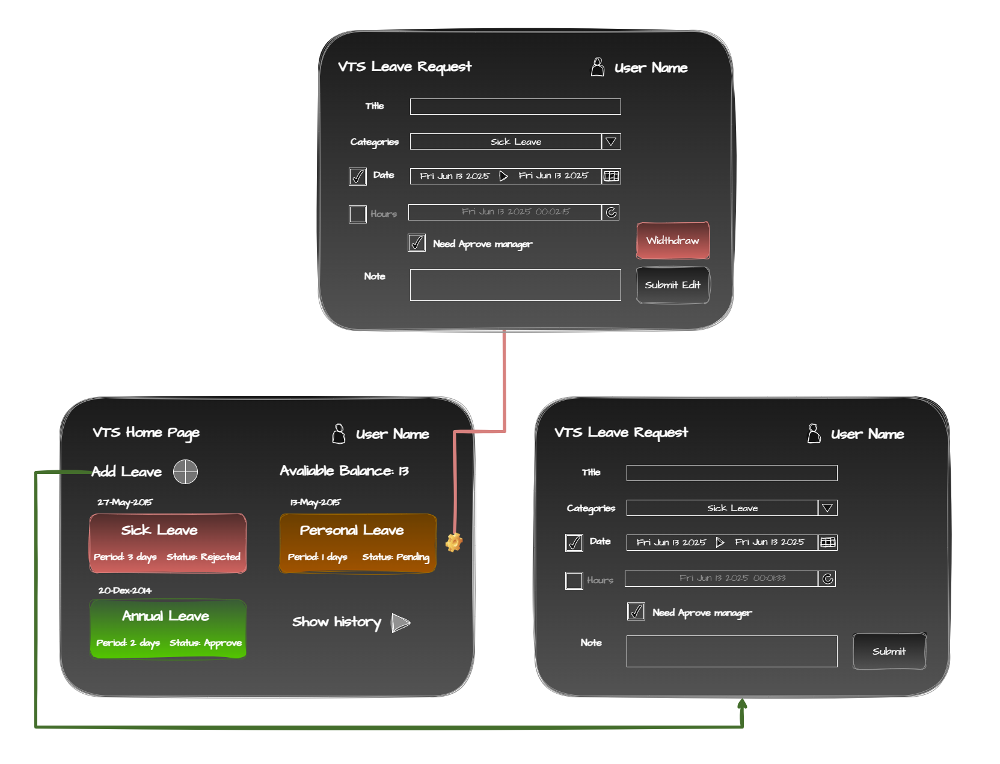
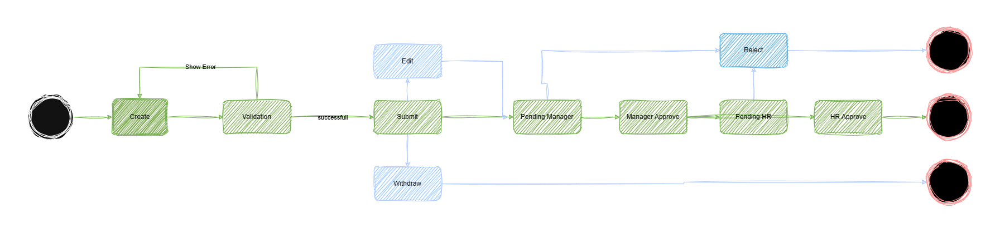

# 🌴 Vacation Tracking System (VTS)

> A complete system to manage vacation requests across an organization efficiently and transparently.

---

## 🎯 Vision

The VTS system provides a unified interface for all employees to request various types of leave:
- Annual Leave
- Sick Leave
- Emergency or Personal Leave

This is done without the need to understand complex company policies. The system automatically directs employees and follows up on requests with managers and HR teams.

---

## ⚙️ Non-Functional Requirements

- ⚡ **Performance**: Respond in ≤ 2s under normal load  
- 📈 **Scalability**: Handle 10,000+ users  
- 🔐 **Security**: Role-Based Access, Encrypted Data  
- 🖥️ **Usability**: Easy to use , Clean, simple interface for all actors  
- 🧱 **Reliability**: Daily auto-backup, 99.9% uptime  

---

## ✅ Functional Requirements

### 👥 Employee Integration
- import all employees from leagacy HR system

### 📩 Leave Request Handling
- Employees can submit, edit, and cancel requests
- View leave balance and past history
- Display future leave plan (up to 1.5 years)

### 📊 Approval Workflow
- Manager can approve/reject
- HR validates policy exceptions

### 🔔 Notification System
- Notify employee about approval/rejection/edit by email
- Notify manager/HR about new requests by email

### 📑 Reporting and Auditing
- Leave trends, availability, logs

### 💼 Balance Adjustments
- HR can manually adjust balances or grant bonuses

---

## ⚠️ Key Constraints

- 🔌 **Integration**: Must work with existing HR/ERP systems  
- 🎨 **EasyToUse**: For non-technical staff Must be Friendly UX , Simple UI, easy to handling request and email notifications
- 🏢 **Limitation**: Web only
- 🗂️ **Data Retention**: Keep data at least 1.5 years ahead

---

## 💡 Domain  
**Human Resources – Vacation and Leave Management**  
As work environments evolve and employees are distributed across different teams and projects, it has become difficult for managers and HR to track and approve leave requests quickly, leading to wasted time, cost, and workflow delays.

---

## 🧍‍♂️ Actors of the System

| Role | Description |
|------|-------------|
| 👤 **Employee** | Requests leave, sees balance |
| 👨‍💼 **Manager** | Reviews and approves requests |
| 🧾 **Clerk (HR)** | Registers employees, edits balances |
| 🖥️ **System Admin** | Manages settings, logs, roles |

---

## 📚 Use Cases

| ID | Title |
|----|-------|
| 1️⃣ | Manage Time |
| 2️⃣ | Approval Request |
| 3️⃣ | Edit Employee Record |
| 4️⃣ | Manage Locations |
| 5️⃣ | Manage Leave Categories |
| 6️⃣ | Award Time |
| 7️⃣ | Override Leave Records |
| 8️⃣ | Backup System Logs |

---

## 📝 Use Case: Manage Time

> Allow employees to create, modify, or withdraw leave requests in a policy-compliant and user-friendly manner.

### 🔄 Create Request
The employee selects the leave category, specifies the desired date and duration, and the system validates the request against available balance and company policies. If valid, the request is sent to the manager for approval.
<details>
<summary> <strong> 🧾 Flowchart Create Leave Request: </strong> </summary>


</details>
<details>
<summary> <strong>📜 Pseudocode: Create Leave Request</strong> </summary>

```pseudocode
Start:
  employeeLogin()

  if employeeLogin == true then
      createLeaveRequest()
  else
      showError("Login Failed")
  end if

Function createLeaveRequest:
  selectLeaveCategory()
  inputVacationDate()
  inputVacationTime()

  if checkValidation() == true then
      sendRequestToManager()
  else
      showError("Validation Failed")
  end if

Function checkValidation:
  if vacationTime > employeeBalanceForCategory then return false
  if vacationDate is in DaysCannotLeave then return false
  if EmployeeAvailable(vacationDate) return false then return false
  return true
```
</details>

---
### ✏️ Edit
The employee can modify a pending leave request that has not yet been reviewed by the manager. After editing, the request is resubmitted to the manager for re-evaluation and approval or rejection.
<details>
<summary> <strong> 🧾 Flowchart Edit Leave Request: </strong> </summary>


</details>
<details>
<summary> <strong> 📜 Pseudocode: Edit Leave Request</strong> </summary>


```pseudocode
Start:
  employeeLogin()

  if employeeLogin == true then
      editLeaveRequest()
  else
      showError("Login Failed")
  end if

--------------------------------------------------------

Function editLeaveRequest:
  selectLeaveRequestToEdit()
  updateVacationDate()
  updateVacationTime()
  updateLeaveCategory()

  if checkValidation() == true then
      saveUpdatedRequest()
      notifyManager("Request Updated")
  else
      showError("Validation Failed")
  end if
```
</details>

---

### ❌ Withdraw
If the leave request is still pending, the employee can withdraw it directly without manager approval. If the request has already been approved, HR intervention may be required to process the withdrawal.

<details>
<summary> <strong>🧾 Flowchart Withdraw Leave Request: </strong></summary>


</details>

<details>
<summary> <strong>📜 Pseudocode: Withdraw Leave Request </strong></summary>

```pseudocode
Start:
  employeeLogin()

  if employeeLogin == true then
      withdrawLeaveRequest()
  else
      showError("Login Failed")
  end if

--------------------------------------------------------

Function withdrawLeaveRequest:
  selectRequestToWithdraw()

  if requestStatus == "pending" or requestStatus == "approved" then
      deleteLeaveRequest()
      notifyManager("Request Withdrawn")
  else
      showError("Cannot withdraw this request")
  end if
```
</details>

---
<details>
<summary> <strong> 👤 User Interface Pages from employee actor view </strong></summary>
  

</details>

---

<details>
<summary> <strong> 🖥️ Manage Time and approval request Sequence diagram </strong></summary>


</details>

---
## 📝 Future status: HR_Pending and HR_Approval
<details>
<summary> <strong>🧾 State Machine Diagram </strong> </summary>


</details>

<details>
<summary> <strong>📜 Pseudocode: Manage Time with approval HR request </strong></summary>

```pseudocode
Start:
  employeeLogin()

  if employeeLogin == true then
      createLeaveRequest()
  else
      showError("Login Failed")
  end if

--------------------------------------------------------

Function createLeaveRequest:
  selectLeaveCategory()
  inputVacationDate()
  inputVacationTime()

  if checkValidation() == true then
      addRequestToDatabase()
      sendRequestToManager()
  else
      showError("Validation Failed")
  end if

--------------------------------------------------------

Function checkValidation:
  if vacationTime > employeeBalanceForCategory then
      return false

  if vacationDate is in DaysCannotLeave then
      return false

  if not isEmployeeAvailable(vacationDate) then
      return false

  return true

--------------------------------------------------------

Function addRequestToDatabase:
  requestId = generateNewId()
  status = "Pending Manager"
  saveRequest(requestId, employeeId, category, date, time, status)

--------------------------------------------------------

Function sendRequestToManager:
  send JSON request to Manager with leave data

  if manager responds with "approve" then
      updateRequestStatus(requestId, "Approved by Manager - Pending HR")
      sendRequestToHR()

  else if manager responds with "reject" then
      updateRequestStatus(requestId, "Rejected by Manager")

--------------------------------------------------------

Function sendRequestToHR:
  send JSON request to HR with leave data

  if HR responds with "approve" then
      updateRequestStatus(requestId, "Approved by HR (Final Approval)")

  else if HR responds with "reject" then
      updateRequestStatus(requestId, "Rejected by HR")
```
</details>
